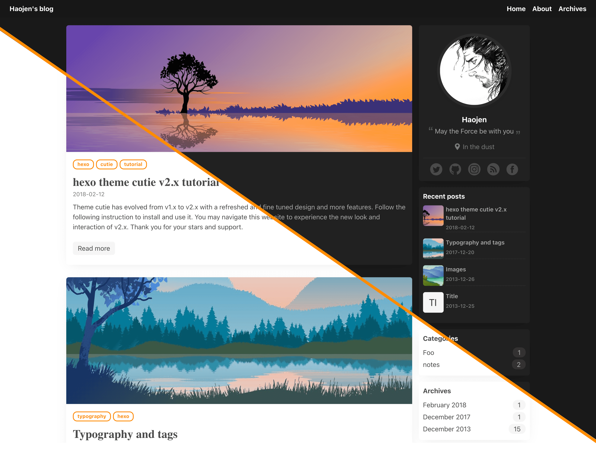

<h1 align="center">Claudia</h1>
<p align="center"> 
  设计简洁 & 轻松上手, 跟随系统外观自适应, 90+ Lighthouse 得分
</p>

<p align="center">
  
  
  
  
</p>


<p align="center">
  <span>简体中文 | </span> 
  <a href="README.md" rel="nofollow">English</a>
</p>

<p align="center">
  <a href="https://haojen.github.io/Claudia-theme-blog/" rel="nofollow">预览 Demo</a>
</p>



## 更新日志
[最近更新 04.12.2021](CHANGELOG.md)


## 使用

### 依赖下载
进入到博客项目根目录下运行：
```bash
#必要
npm install hexo-renderer-pug 
npm install hexo-renderer-sass
npm install hexo-generator-search

#选择性安装
# 如果需要添加订阅功能
npm install hexo-generator-feed
# 流程图功能
npm install hexo-filter-flowchart --save   
# Emoji
npm install hexo-filter-github-emojis --save  
# 搜索功能
npm install hexo-generator-search --save   
# 数学公式
npm install hexo-renderer-mathjax --save
```

## 用户信息配置

注意: 必须在主题的 `_config.yml` 中配置以下信息, 而非博客根目录下的 `_config.yml`

``` yaml
user:
  name: 
  avatar: /images/avatar.jpg
  location:
  description:
  footnotes:

# config you SNS
social:
  zhihu:
  twitter:
  facebook:
  linkedin:
  instagram:
  github: haojen

```

### 配置导航栏右上角菜单项

```yaml
 # main menu navigation
 menu:
   Home: /
   About: /about
   Archives: /archives
```

### 边栏部件配置
```yaml
widgets:
  - tag
  - archive
  - category
  - recent_posts
```

### 使用评论系统

#### 1. Utteranc
对应文档地址: https://utteranc.es/

对应项目地址: https://github.com/utterance/utterances

```yaml
comment_utteranc:
  enable: true
  repo: Haojen/myBlogRepo # change to your blog repo
```

#### 2. Valine
使用文档： https://valine.js.org/quickstart.html

```yaml
comment_valine:
  enable: true
  appId:
  appKey:
```


### 夜间模式设置
```yaml
# 1.light 
# 2.dark
# 3.auto (默认，跟随系统外观)
appearance: auto
```

## 配置代码高亮

在theme主题目录下, 可以通过 `_config.yml` 文件(注意不是hexo根目录), 配置代码高亮的style, 步骤如下:
首先在您的hexo根目录下 `_config.yml` , 关闭内置的着色器:
```yaml
highlight:
  enable: false
```

## 统计
配置谷歌和百度统计
```yaml
#Baidu Analytics**
ba_track_id: 

#Google Analytics
ga_track_id: 
ga_domain:
```
	
## 创建 About 页面
在博客根目录下的 `source` 文件夹里创建一个 `about` 文件夹, 然后打开该文件夹, 新建一个 `index.md`, 打开, 将下面这段文本复制到 `index.md` 里保存

```yaml
---
title: about
date: 2017-05-31 10:05:56
layout: about
---
```
	
## 范例项目展示

https://github.com/Haojen/Claudia-theme-blog  

## 最后

如果遇到任何问题或反馈建议，请发起 issue

## 我的另外一款 Hexo 主题
[Hexo-theme-Anisina](https://github.com/Haojen/hexo-theme-Anisina)

## License

MIT © [haojen ma](http://haojen.github.io)
