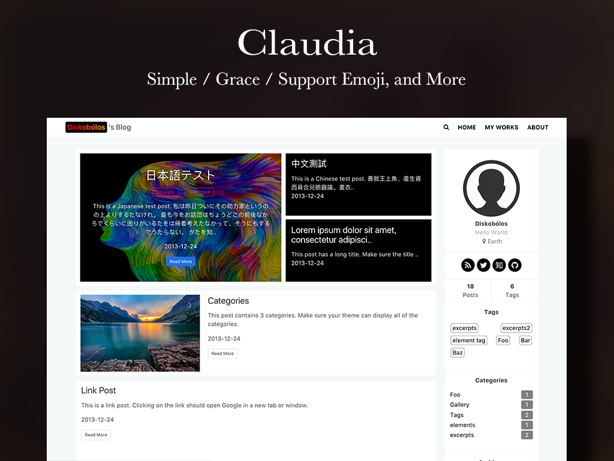

# Claudia

[简体中文](./README-EN.md) | English

[Click me to preview](https://haojen.github.io/Claudia-theme-blog/)



## How to Use

### Upper-right navigation bar menu config

Attention: Configure the file `_config.yml` under the theme profile ,not the one in root of whole hexo direction

```yaml
 # main menu navigation
 menu:
   Home: /
   About: /about
   Archives: /archives
```

## Sidebar widget config

```yaml
widgets:
  - tag
  - archive
	- category
	- recent_posts
```

## User's profile

Configure the file `_config.yml` under the theme profile, not the one in  root of whole hexo direction

```yaml
user:
  name: 
  avatar: /images/avatar.jpg
  location:
  description:

// config you SNS
social:
  zhihu:
  twitter:
  facebook:
  linkedin:
  instagram:
  github: haojen

```

## Code highlighting

1. Disable the default hexo highlight configuration(modify your `_config.yml` in main directory of hexo)

```yaml
highlight:
enable: false
```

## Create About Page

Create a new folder `about` under the source of hexo, and then, create a `index.md` file and copy the following content into it.

```yaml
--
title: about
date: 2017-05-31 10:05:56
layout: about
---

About Somebody
```

### Set post cover image

`cover-image`:  set  cover image path

```yaml
--
title: post title
categories: [notes]
date: 2020-12-25 10:05:56
tags: [hexo, cutie, tutorial]
cover-image: /images/yourImg.png
---
```

## License

MIT © [haojen ma](http://haojen.github.io/)
